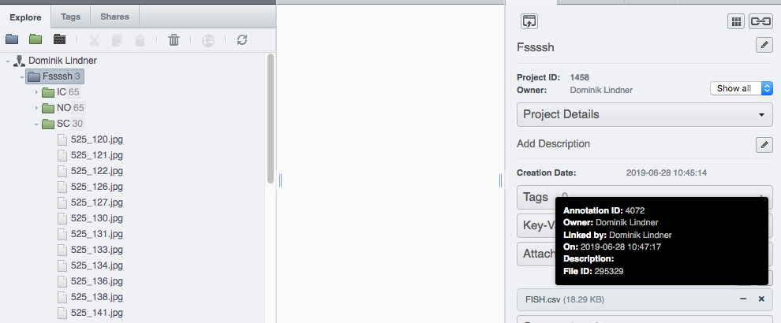

shapeRO
=======

This is an 'OMEROified' version of [shapeR - 0.1-5](https://github.com/lisalibungan/shapeR) .

Use an OMERO project and attached csv file instead of a project and csv on the filesystem.

For an example see [example.R](example.R) which uses an OMERO project setup like this:

